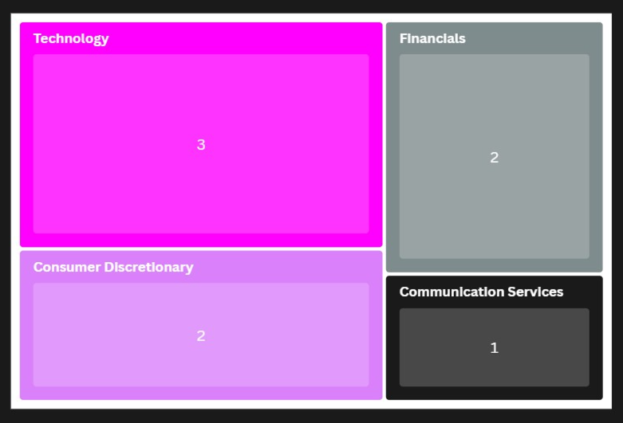
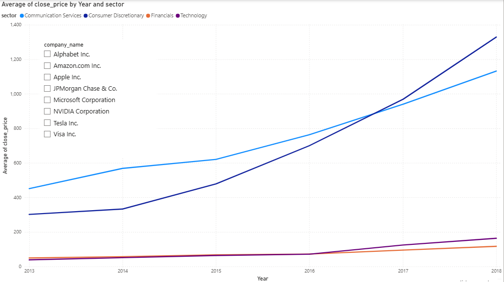
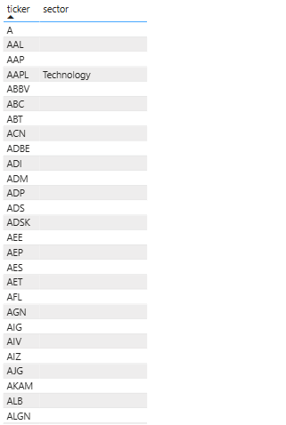

# S&P 500 Financial Trend Analysis
### **SQL | Data Engineering | Power BI | Financial Analytics**
> *Analysing 500+ tickers to evaluate Sector ROI and Market Volatility using a relational MySQL workbench 8.0.*

---

### Executive Summary
This project uses **MySQL** to process S&P 500 stock data, identifying market leaders and risk factors. By joining price action with sector metadata, I transformed raw CSV data into a relational model to generate actionable financial insights.

### Technical Stack
* **Database Engine**: MySQL 8.0
* **Visualization**: Power BI Desktop (Connected via SQL Server)
* **Key Skills**: Relational Joins, Data Normalization, Aggregate Functions, Data Auditing.

---

### Market Insights & Dashboards

#### **Sector Composition (Volume Analysis)**
I used a Treemap to verify the distribution of companies across different sectors in my database.

* **Top Sectors**: Technology and Financials dominate the current schema.
* **Validation**: This visual confirms that the primary sectors are correctly mapped without duplicates.

#### **Interactive Sector Performance**
This dashboard tracks price trends over time, allowing for a comparison of how different industries react to market conditions.

* **Average Price Trends**: Comparative analysis of Communication Services, Consumer Discretionary, Financials, and Technology.
* **Dynamic Filtering**: Implemented Slicers to drill down into specific company performance (e.g., Apple, Amazon, Tesla).

---

### Data Quality & Auditing
A core part of this project was identifying and managing data inconsistencies. I used a dedicated audit table to isolate "Blank" sectors.

* **Integrity Check**: Identified that certain tickers (e.g., A, AAL, AAP) lacked corresponding metadata in the company info table.
* **The Fix**: Applied visual-level filtering to maintain professional report clarity while documenting the need for future SQL data cleaning.

---

### key insights
* **top performer**: The Communication Services sector showed the highest stability with an average ROI of 0.02.
* **highest risk**: The Technology sector faced the most significant headwinds during this period, with an average ROI of -0.08.
* **volatility analysis**: Calculated both Dollar-based and Percentage-based volatility to compare high-priced stocks (like Amazon) fairly against the broader market.

---

### financial glossary
* **ROI**: % gain/loss vs. initial cost.
* **Volatility**: Statistical risk (Standard Deviation) of price swings.
* **Headwinds**: Market conditions slowing growth.
* **Close Price**: Standard benchmark for daily performance.
